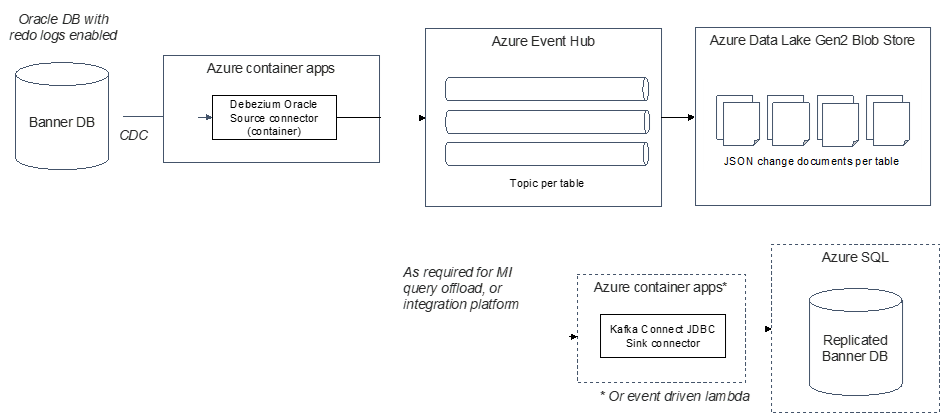

# stars-debezium-poc

### Work in progress

This is the repository for the Debezium container registry Terraform code as a proof of concept.

### Docker container

The intention of this POC is to demonstrate the capabilities of Debezium to sink data from Oracle database to Azure Data Lake in real time.

A simple flow diagram of this POC looks like this:

### Create Debezium Connect Image

1. Clone this repo.

2. Download Oracle driver & unzip at src/docker/debezium-with-oracle-jdbc/oracle_instantclient/ — https://download.oracle.com/otn_software/linux/instantclient/1914000/instantclient-basic-linux.x64-19.14.0.0.0dbru.zip

### Run Container
1. Update connector-new-uob.json and compose-uon-new.yml files - replace strings *****UPDATE** ** *
2. Navigate to the folder containing project and run command: <code>docker-compose -f compose-uob-new.yml up -d</code>

### Register oracle connector

<code>curl -i -X POST -H "Accept:application/json" -H "Content-Type:application/json" localhost:8083/connectors -d @connector-new-uob.json</code>

### Connector commands

- Listing current connectors names: 
<code>curl -X GET http://localhost:8083/connectors</code>

- Stopping the connector: 
<code>curl -X PUT http://localhost:8083/connectors/oracle-connector/pause</code>

- Starting the connector: 
<code>curl -X PUT http://localhost:8083/connectors/oracle-connector/resume</code>

- Deleting the connector: 
<code>curl -X DELETE http://localhost:8083/connectors/oracle-connector/</code>